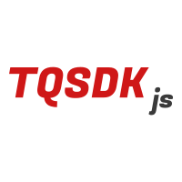

# TQSDK - JS 

天勤 [DIFF 协议 (https://www.shinnytech.com/diff/)](https://www.shinnytech.com/diff/) 的封装（JavaScript 语言版本）。

<p align="center">
    <a href="https://www.shinnytech.com/diff" target="_blank" rel="noopener noreferrer">
        
    </a>
</p>

<p align="center">
    <a href="https://www.npmjs.com/package/tqsdk"></a>
   <a href="https://www.npmjs.com/package/tqsdk"></a>
  <a href="https://www.npmjs.com/package/tqsdk"></a>
</p>

## 1. 安装


### 方案一

Html 文件添加

```html
<script src="lib/tqsdk.js"></script>
```

JavaScript 文件中可以直接使用：

```js
var tqsdk = new TQSDK();
```

### 方案二

采用 es6 开发，项目根目录下运行

```bash
npm install tqsdk
```

js 中引用

```js
import TQSDK from 'tqsdk'

let tqsdk = new TQSDK({})
```

## 2. 使用

### 2.1 初始化

```js
// 建议全局只初始化一次，后面只使用实例 tqsdk
const tqsdk = new TQSDK()
```

### 2.2 on 事件监听 

```js
// 添加事件监听
tqsdk.on(eventName, cb)

// 取消事件监听
tqsdk.off(eventName, cb)
```

支持的事件：

|eventName|cb 回调函数参数|事件触发说明|
|---|---|---|
|ready | | 收到合约基础数据|
|rtn_brokers | [] 期货公司列表 | 收到期货公司列表|
|notify | {} 单个通知对象 | 收到通知对象|
|rtn_data | | 数据更新（每一次数据更新触发）|
|error | error | 发生错误(目前只有一种：合约服务下载失败)|

 :warning: 监听 `rtn_data` 事件，可以实时对行情数据变化作出响应。但是需要在相应组件 destory 的时候取消监听对应事件。

### 2.3 其他接口

`TQSDK` 支持以下功能，详情参见 [API](#api)：

* [x] 查询合约行情。
* [x] 查询合约 K线图，Tick图，盘口报价。
* [x] 登录期货交易账户。
* [x] 查看账户资金、持仓记录、委托单记录。
* [x] 多账户查询。
* [x] 支持穿透视监管。
* [ ] 查询历史结算单。

## 3. API

+ subscribe_quote 订阅合约

```
function subscribe_quote (payload: string | array)
```

example: 

```js
tqsdk.subscribe_quote('cu1901')

tqsdk.subscribe_quote(['cu1901', 'au1906'])
 
```

+ login 登录

```
function login(payload: object) : null {}

payload = {
    bid: string,
    user_id: string,
    password: string
}
```

+ add_account 添加期货账户信息

```
function add_account(bid: string, user_id: string, password: string) : null
```
    
+ remove_account 删除期货账户信息

```
function remove_account(bid: string, user_id: string, password?: string) : null
```

+ get_quote 获取合约详情

```
function get_quote(symbol: string) : object
```

+ get 获取数据

```
function get(payload: object) : object

{
    // 交易 ['users', 'user', 'session', 'accounts', 'account', 'positions', 'position', 'orders', 'order', 'trades', 'trade']
    // 行情 ['quotes', 'quote', 'ticks', 'klines', 'charts', 'chart']
    name = 'users',
    user_id = '', // 以下 name 有效 ['user', 'session', 'accounts', 'account', 'positions', 'position', 'orders', 'order', 'trades', 'trade']
    currency = 'CNY', // 以下 name 有效 ['account']
    symbol = '', // 以下 name 有效 ['position'] ['quote', 'ticks', 'klines']
    order_id = '', // 以下 name 有效 ['order']
    trade_id = '', // 以下 name 有效 ['trade']
    chart_id = '', // 以下 name 有效 ['chart']
    input = '', // 以下 name 有效 ['quotes']
    duration = 0,  // 以下 name 有效 ['klines']
}
```

|name|payload|
|---|---|
|'users' | `{name}` |
|'user' | `{name, user_id}` |
|'session' | `{name, user_id}` |
|'accounts' | `{name, user_id}` |
|'account' | `{name, user_id, currency}` |
|'positions' | `{name, user_id}` |
|'orders' | `{name, user_id}` |
|'trades' | `{name, user_id}` |
|'position' | `{name, user_id, symbol}` |
|'order' | `{name, user_id, order_id}` |
|'trade' | `{name, user_id, trade_id}` |
|'quotes' | `{name, input}` |
|'quote' | `{name, symbol}` |
|'klines' | `{name, symbol, duration}` |
|'ticks' | `{name, symbol}` |

+ get_by_path 根据路径获取数据

```
function get_by_path (path: string | array) : object
```

+ set_chart 订阅图表

```
function set_chart (payload: object) : null
```

+ get_quotes_by_input 根据输入返回合约集合

```
function get_quotes_by_input (_input: string) : object
```

+ get_trading_day 获取当前交易日

```
function get_trading_day () : string
```
+ is_changed 数据最近是否更新

```
function is_changed(target: string | object, source?: object)
```

+ is_logined 是否登录成功

```
function is_logined(payload) : boolean
payload = {
    bid: string,
    user_id: string
}
```

+ transfer 银期转帐

+ his_settlement 查询历史结算单

```
function his_settlement(payload) : null
payload = {
    bid: string,
    user_id: string,
    trading_day: number
}
```

+ insert_order 下单 <sup style="color:red;">deprecated</sup>

+ auto_insert_order 自动平昨平今 <sup style="color:red;">deprecated</sup>

+ cancel_order 撤单 <sup style="color:red;">deprecated</sup>

+ confirm_settlement 确认结算单 <sup style="color:red;">deprecated</sup>

## Vue Plugin

TQSDK - JS 封装为 Vue 插件，可以在组件中监听事件，不需要在单独取消监听。


```js
import Vue from 'vue'
import TQSDK from 'tqsdk'

let tqsdk = new TQSDK()

const NOOP = () => {}
let tqVmEventMap = {}
let tqsdkRE = /^tqsdk:/

function mixinEvents(Vue) {
  let on = Vue.prototype.$on
  let emit = Vue.prototype.$emit

  Vue.prototype.$on = function proxyOn(eventName, fn = NOOP) {
    const vm = this
    if (Array.isArray(eventName)) {
      eventName.forEach((item) => vm.$on(item, fn));
    } else if (tqsdkRE.test(eventName)) {
      if (!tqVmEventMap[vm._uid]) tqVmEventMap[vm._uid] = {}
      let tq_eventName = eventName.match(/^tqsdk:(.*)/)[1]
      if (!tqVmEventMap[vm._uid][tq_eventName]) tqVmEventMap[vm._uid][tq_eventName] = []
      tqVmEventMap[vm._uid][tq_eventName].push(fn)
      tqsdk.on(tq_eventName, fn.bind(vm))
    } else {
      on.call(vm, eventName, fn)
    }
    return vm
  }
}

function applyMixin(Vue) {
  Vue.mixin({
    beforeDestroy() {
      const vm = this
      const tqevents = tqVmEventMap[vm._uid] || {};
      for (let eventName in tqevents) {
        let eventsArr = tqevents[eventName]
        eventsArr.forEach((fn) => {
          tqsdk.removeEventListener(eventName, fn)
        })
      }
      delete tqVmEventMap[vm._uid];
    }
  })
}

function plugin(Vue) {
  if (VERSION < 2) {
    console.error('[vue-event-proxy] only support Vue 2.0+');
    return;
  }
  // Exit if the plugin has already been installed.
  if (plugin.installed) return
  plugin.installed = true
  mixinEvents(Vue)
  applyMixin(Vue)
}

Vue.use(plugin)

Vue.$tqsdk = tqsdk
Vue.prototype.$tqsdk = tqsdk

export default tqsdk;
```
