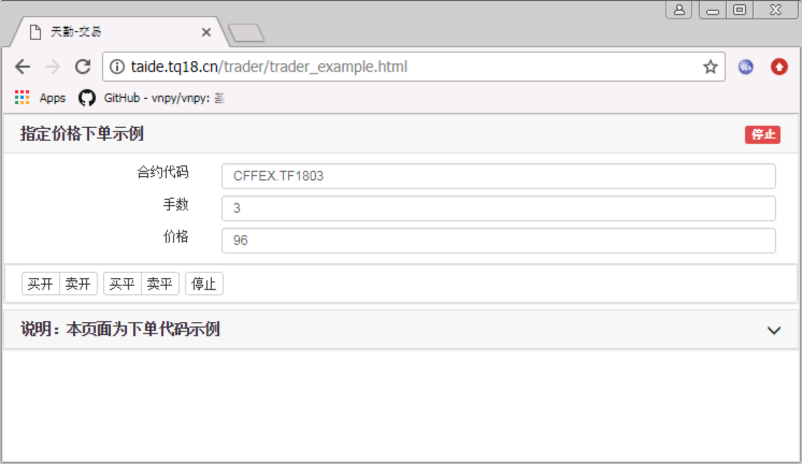

.. _2_2_config:

修改界面
=======================================

本项目使用了 JQuery，所有的 JQuery 方法 都可以使用。

分析交易程序需求
---------------------------------------

我们先来看看最后要呈现的效果：

我们把需要的参数列出来
~~~~~~~~~~~~~~~~~~~~~~~~~~~~~~~~~~~~~~~~~

+------------+------------+--------------+
| name       | id         | default      |
+============+============+==============+
| 合约       | instrument | CFFEX.TF1803 |
+------------+------------+--------------+
| 手数       | volume     | 3            |
+------------+------------+--------------+
| 价格       | limit_price| 96           |
+------------+------------+--------------+

说明::

    1. id 的设定只要符合 Javascript 变量名命名规则即可，这里为了提高代码的可读性和后续使用方便，命名和下单接口对应的字段 key 值相同。
    2. 默认值可以根据您的需要设定。

页面上的控制按钮
~~~~~~~~~~~~~~~~~~~~~~~~~~~~~~~~~~~~~~~~~

data-direction="BUY" data-offset="OPEN"
    
+------------+------------+------------+-----------+ 
|    type    |    name    |         操作           | 
|            |            +------------+-----------+ 
|            |            | direction  | offset    | 
+============+============+============+===========+ 
| 开始交易   | 买开       | "BUY"      | "OPEN"    | 
|            +------------+------------+-----------+ 
|            | 卖开       | "SELL"     | "OPEN"    | 
|            +------------+------------+-----------+ 
|            | 买平       | "BUY"      | "CLOSE"   | 
|            +------------+------------+-----------+
|            | 卖平       | "SELL"     | "CLOSE"   | 
+------------+------------+------------+-----------+
| 停止交易   | 停止       |                        | 
+------------+------------+------------+-----------+ 

在页面上显示对应的 UI
---------------------------------------

界面关键代码

.. code-block:: html

    <input type="text" placeholder="合约代码" value="CFFEX.TF1803" id="instrument">

    <input type="number" placeholder="手数" value="3" id="volume">

    <input type="number" placeholder="价格" value="96" id="limit_price">

    <button type="button" class="START" data-direction="BUY" data-offset="OPEN">买开</button>
    <button type="button" class="START" data-direction="SELL" data-offset="OPEN">卖开</button>
    <button type="button" class="START" data-direction="BUY" data-offset="CLOSE">买平</button>
    <button type="button" class="START" data-direction="SELL" data-offset="CLOSE">卖平</button>

    <button type="button" class="STOP">停止</button>

说明::

    1. 所有标签的 id 不能重复。
    2. input 标签 placeholder 表示显示的提示词，value 表示显示的默认值，id 表示字段唯一标识。
    3. button 用 data- 的表示数据， data-direction 表示方向，data-offset 表示开平。

刷新页面，即可看到页面 UI 显示的内容已经发生变化。

下一步
-------------------------------------------------------
到此，我们已经把界面显示的元素编辑好了，下面，就开始编辑交易逻辑。

