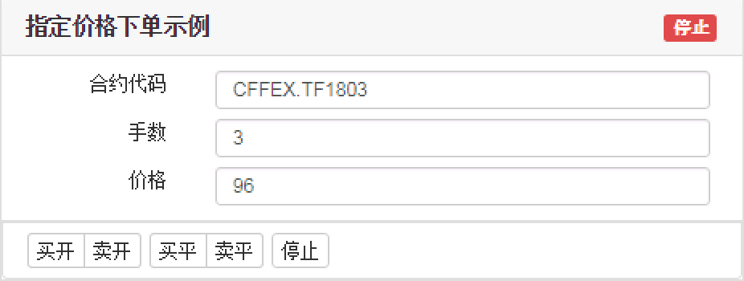

.. _quick_start:

Quick Start
#################################################

目标
=================================================

示例的目标：构建一个交易算法，以指定价格、手数下单，直到全部手数成交。

最终界面如下图所示：

+ 在这个示例程序中，将会完成以下步骤：

1. 监听用户单击事件，获取用户交易买卖、开平的参数
2. 读取用户中页面上填写的其他参数
3. 根据这些参数，下单
4. 如果挂单交易完成，结束程序；如果用户单击结束按钮，撤单后结束程序

环境准备
======================================================

在开始真正编写代码前，先来检查以下你的电脑环境，确保达到以下要求：

+ 首先需要安装天勤客户端， `天勤客户端下载地址`_ 。
+ 选择一款文本编辑器
    - sublime
    - vscode
    - nodepad++
    - 等等
+ Chrome 浏览器， `Chrome 浏览器下载地址`_ 。

新建交易程序
======================================================

软件自带的交易页面存储的位置在天勤软件安装目录下的 extension 文件夹中(默认为C:\TianQin\extension)，本章通过一个完整示例，来告诉用户如何自定义交易程序。

原则上一个主要的交易程序的逻辑在一个页面中完成，页面主要包括两个部分：

1. UI 界面，用来展示信息和用户交互。UI 界面就是普通的 HTML。如果您还不熟悉，可以参考 `Html 教程`_。

2. JavaScript 逻辑部分，主要负责实现交易逻辑。本篇教程主要针对这一部分。为了方便书写，我们把负责交易逻辑的 javascript 代码添加到页面的 script 标签里。

本章示例程序为 ``example.html`` 文件，它完整实现本示例的 demo。

.. tip::
    - 软件自带的交易页面存储的位置在安装目录下的 ``extension`` 文件夹中。
    - 当您自己编写新的交易程序时，可以复制 ``example.html``，然后修改文件名和内容。

查看界面
-------------------------------------------------------

打开天勤客户端，选择 “添加板块” --> “扩展板块”，右击新添加的板块，右键菜单中选择配置，在配置界面中添加文件名 ``example.html``。

.. note::
    配置面板上填写的文件名就是 ``extension`` 文件夹下的文件名。

这时候软件中应该能够显示以下界面：

.. figure:: _static/example_ui_client.png
    :width: 800px
    :figwidth: 80%
    :alt: map to buried treasure

在页面上显示对应的 UI
-------------------------------------------------------

分析之前页面截图，可以得到页面需要以下这些参数：

+ 界面上需要用户填写的参数有：

+------------+------------+--------------+
| name       | id         | default      |
+============+============+==============+
| 合约       | symbol     | CFFEX.TF1803 |
+------------+------------+--------------+
| 手数       | volume     | 3            |
+------------+------------+--------------+
| 价格       | limit_price| 96           |
+------------+------------+--------------+

+ 用户点击按钮时，规定了买卖、开平方向，这一点通过为按钮添加参数来实现：

========== ========== ==========
button     direction  offset
========== ========== ==========
买开         BUY        OPEN
卖开         SELL       OPEN
买平         BUY        CLOSE
卖平         SELL       CLOSE
========== ========== ==========

界面关键代码

.. code-block:: html

    <input type="text" placeholder="合约代码" value="CFFEX.TF1803" id="symbol">
    <input type="number" placeholder="手数" value="3" id="volume">
    <input type="number" placeholder="价格" value="96" id="limit_price">

    <button type="button" class="START" data-direction="BUY" data-offset="OPEN">买开</button>
    <button type="button" class="START" data-direction="SELL" data-offset="OPEN">卖开</button>
    <button type="button" class="START" data-direction="BUY" data-offset="CLOSE">买平</button>
    <button type="button" class="START" data-direction="SELL" data-offset="CLOSE">卖平</button>
    <button type="button" id="STOP">停止</button>

.. hint::

    1. 所有标签的 id 不能重复，表示字段唯一标识。
    #. id 的设定只要符合 Javascript 变量名命名规则即可，这里为了提高代码的可读性和后续使用方便，命名和下单接口对应的字段 key 值相同。
    #. 默认值可以根据您的需要设定。
    #. input 标签 placeholder 表示显示的提示词，value 表示显示的默认值。
    #. button 用 data- 的表示数据， data-direction 表示方向，data-offset 表示开平。

关于页面构成，及页面按钮的监听方式，在 :ref:`ui` 部分有详细说明。

完成交易逻辑
=======================================

简单来说，交易任务用一个 generate function 来表示，形式为

.. code-block:: javascript

    const TQ = new TQSDK();
    function* TaskOrder([options]) {
        ...
        var result = yield {}
        ...
        return;
    }

.. note::
    - 形式上，关键字 ``function`` 和函数名中间必须有一个 ``*``。
    - 函数的参数，第一个参数为系统提供的环境，以及生成任务时传入的参数。
    - 关键字 ``yield`` 表示，函数在执行到这里时，会检查后面对象表示出的条件，并以对象形式返回，后面代码中就可以根据返回的内容执行不同的逻辑。
    - 关键字 ``return`` 表示函数执行完毕。

关于 Task 框架在 :ref:`task` 有完整的说明。

完整的示例代码
-------------------------------------------

.. code-block:: javascript

    const TQ = new TQSDK();
    function* TaskOrder(direction, offset) {
        TQ.SET_STATE('START');

        var params = TQ.UI(); // 读取页面参数
        params.direction = direction;
        params.offset = offset;

        var order = TQ.INSERT_ORDER(params);

        var result = yield {
            FINISHED: function () { return order.status === "FINISHED" },
            USER_CLICK_STOP: TQ.ON_CLICK('STOP'),
        };
        if (result.USER_CLICK_STOP)
            TQ.CANCEL_ORDER(order);
        // 任务结束
        TQ.SET_STATE('STOP');
    }

    $('button.START').on('click', function (e) {
        var data = e.target.dataset;
        TQ.START_TASK(TaskOrder, data.direction, data.offset);
    });

.. note::
    - 当设置 TQ.SET_STATE('START') 后，界面显示任务运行中，任务运行过程中不可以修改界面参数。
       要想修改参数，需要停止任务 => 修改参数 => 重新开始任务。

    - TQ.UI() 函数不传入参数，可以读取用户在页面填入全部的参数。
       本例中有 3 个参数：合约代码，下单手数，下单价格。

    - 下单方向和开平是根据用户单击不同的按钮，传入不同的参数 direction（买卖），offset（开平）

    - GET_QUOTE 方法可以获得指定的合约对象。

    - ON_CLICK 函数可以监听页面按钮的单击事件，返回被监听对象绑定的 data-xxx 数据。

    - 根据 INSERT_ORDER 下单函数需要的参数，我们为 params 添加需要的字段

    - 程序每收到一个数据包，就会运行到关键字 yield 位置，检查 yield 之后的对象的真值，本例中检查 2 个条件：
        CHANGED：最近一次数据包中是否包含所下单 order 的信息。

        USER_CLICK_STOP：用户时候提前单击了结束按钮

    - 检查到某个条件值为真时，会返回 result

    - 当 order.status === "FINISHED" 成立时，completed 置为真，任务完成

    - 当用户提前单击结束按钮时，撤掉发出的订单，completed 置为真，任务完成

    - 界面显示任务结束，任务运行结束可以修改界面参数

运行交易程序
-------------------------------------------

在天勤客户端中，右击刚刚添加的板块，右键菜单中选择 ``重新加载``。每次修改完页面都需要重新加载以使修改生效。

到此，我们就可以正式运行任务下单了。

单击买开或者卖开按钮，即可开始运行下单任务。试试吧。

.. _Html 教程: http://www.w3school.com.cn/html/index.asp
.. _天勤客户端下载地址: http://tq18.cn/
.. _Chrome 浏览器下载地址: https://www.google.com/chrome/browser/desktop/index.html
