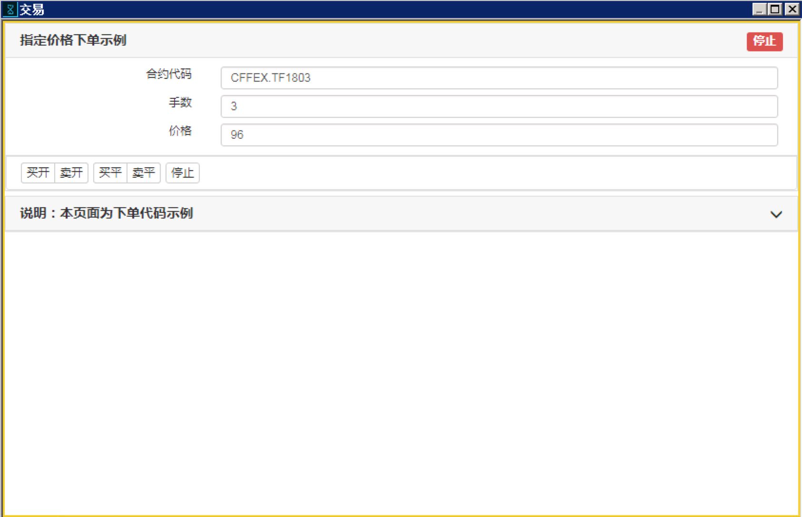
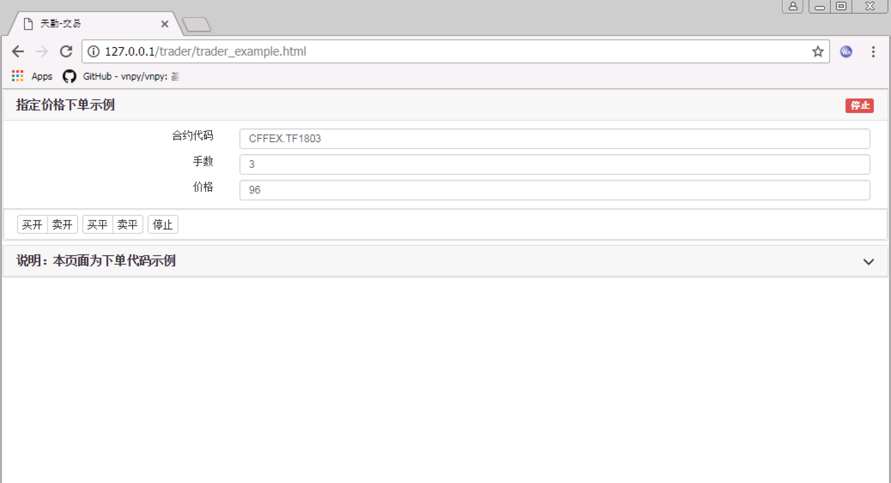

Quick Start
########################################

目标
========================================
示例的目标：构建一个交易算法，以指定价格、手数下单，直到全部手数成交。

我们把界面上的参数列出来：

+ 用户填写的参数

+------------+------------+--------------+
| name       | id         | default      |
+============+============+==============+
| 合约       | instrument | CFFEX.TF1803 |
+------------+------------+--------------+
| 手数       | volume     | 3            |
+------------+------------+--------------+
| 价格       | limit_price| 96           |
+------------+------------+--------------+

+ 点击按钮时，携带的参数

========== ========== ==========
button     direction  offset
========== ========== ==========
买开         BUY        OPEN
卖开         SELL       OPEN
买平         BUY        CLOSE
卖平         SELL       CLOSE
========== ========== ==========

在整个交易程序中，需要完成以下步骤：

1. 监听用户单击事件，获取用户交易买卖、开平的参数
2. 读取用户中页面上填写的其他参数
3. 根据这些参数，下单
4. 如果挂单交易完成，结束程序；如果用户单击结束按钮，撤单后结束程序

环境准备
========================================

在开始真正编写代码前，先来检查以下你的电脑环境，确保达到以下要求：

+ 首先需要安装天勤客户端， `天勤客户端下载地址`_ 。
+ 选择一款文本编辑器
    - sublime
    - vscode
    - nodepad++
    - 等等
+ Chrome 浏览器， `Chrome 浏览器下载地址`_ 。

新建交易程序
======================================================

软件自带的交易页面存储的位置在 <...>，本章的通过一个完整示例，来告诉用户如何自定义交易程序。

原则上一个主要的交易程序的逻辑在一个页面中完成，页面主要包括两个部分：

1. UI 界面，用来展示信息和用户交互。UI 界面就是普通的 HTML。如果您还不熟悉，可以参考 `Html 教程`_。

2. JavaScript 逻辑部分，主要负责实现交易逻辑。本篇教程主要针对这一部分。

新建文件
-------------------------------------------------------

在交易页面存储的目录下，找到文件 ``trader_example.html``。

文件 ``trader_example.html`` 完整实现本示例的 demo。

.. tip::
    当您自己编写新的交易程序时，可以复制 ``trader_example.html``，直接修改文件名和内容。

查看界面
-------------------------------------------------------

有两种方式可以：

方式一、在天勤客户端中打开
*******************************************************
选择 “添加板块” --> “扩展板块”，右击新添加的板块，右键菜单中选择配置，在配置界面中 URL 字段中，填入 http://taide.tq18.cn/trader/trader_example.html。

这时候软件中应该能够显示以下界面：

方式二、在 Chrome 浏览器中打开
*******************************************************
打开 Chrome 浏览器，输入地址 http://taide.tq18.cn/trader/trader_example.html。

这时候页面应该能够显示以下界面：

目前，我们已经有了一个简单页面，下面我们就来修改代码，实现最终的交易需求。

在页面上显示对应的 UI
---------------------------------------

界面关键代码

.. code-block:: html

    <input type="text" placeholder="合约代码" value="CFFEX.TF1803" id="instrument">

    <input type="number" placeholder="手数" value="3" id="volume">

    <input type="number" placeholder="价格" value="96" id="limit_price">

    <button type="button" class="START" data-direction="BUY" data-offset="OPEN">买开</button>
    <button type="button" class="START" data-direction="SELL" data-offset="OPEN">卖开</button>
    <button type="button" class="START" data-direction="BUY" data-offset="CLOSE">买平</button>
    <button type="button" class="START" data-direction="SELL" data-offset="CLOSE">卖平</button>

    <button type="button" class="STOP">停止</button>

.. hint::

    1. 所有标签的 id 不能重复，表示字段唯一标识。
    #. id 的设定只要符合 Javascript 变量名命名规则即可，这里为了提高代码的可读性和后续使用方便，命名和下单接口对应的字段 key 值相同。
    #. 默认值可以根据您的需要设定。
    #. input 标签 placeholder 表示显示的提示词，value 表示显示的默认值。
    #. button 用 data- 的表示数据， data-direction 表示方向，data-offset 表示开平。

页面上的控制按钮
---------------------------------------

.. code-block:: html

    <button type="button" id="START" data-direction="BUY" data-offset="OPEN">买开</button>

针对以上按钮，有两种监听按钮事件的方式：

1. 传统的 JQuery 方案
~~~~~~~~~~~~~~~~~~~~~~~~~~~~~~~~~~~~~~~

    利用 JQuery 提供的 on 函数来监听事件。

.. code-block:: javascript

    $(function(){
        $('#START').on('click', function(){
            START_TASK(xxxtask);
        });
    });

2. 利用系统提供的 ON_CLICK 监听函数
~~~~~~~~~~~~~~~~~~~~~~~~~~~~~~~~~~~~~~~

在 Task 函数内部，则需要通过 C.ON_CLICK 监听按钮事件，返回的对象就是 data-xxx 构成的对象。

.. code-block:: javascript

    function* TaskOrder(C) {
        var wait = yield {
            'START': C.ON_CLICK('START'),
        }
        C.SET_STATE('START');

        var params = UI(); 
        params.direction = wait.START.direction; // "BUY"
        params.offset = wait.START.offset; // "OPEN"

        ......
    }

下一步，开始完成编辑交易逻辑。

交易程序
=======================================

交易任务用一个 generate function 来表示，形式为 

.. code-block:: javascript

    function* TaskName(C [, options] ) {
        ...
        var result = yield {}
        ...
        return;
    }

.. note:: 
    - 形式上，关键字 ``function`` 和函数名中间必须有一个 ``*``。
    - 函数的参数，第一个参数为系统提供的环境，以及生成任务时传入的参数。
    - 关键字 ``yield`` 表示，函数在执行到这里时，会检查后面对象表示出的条件，并以对象形式返回，后面代码中就可以根据返回的内容执行不同的逻辑。
    - 关键字 ``return`` 表示函数执行完毕。

交易步骤
-------------------------------------------

1. 监听用户单击事件，获取用户交易买卖、开平的参数
2. 读取用户中页面上填写的其他参数
3. 根据这些参数，下单
4. 如果挂单交易完成，结束程序；如果用户单击结束按钮，撤单后结束程序

Example
-------------------------------------------

完整的代码如下：

.. code-block:: javascript

    function* TaskOrder(C) {

        // 1. 监听用户单击事件，  
        var wait = yield {
            'START': C.ON_CLICK('START'),
        }
        C.SET_STATE('START');

        // 1. 获取用户交易买卖、开平的参数  
        params.direction = wait.START.direction;
        params.offset = wait.START.offset;
        
        // 2. 读取用户中页面上填写的其他参数
        var params = UI(); 

        var [exchange_id, instrument_id] = params.instrument.split('.');
        Object.assign(params, { exchange_id, instrument_id });

        var completed = false;
        // 3. 根据这些参数，下单
        var order = C.INSERT_ORDER(params);

        while (order && !completed) {
            var result = yield {
                // 4. 如果挂单交易完成，结束程序；
                CHANGED: function () { return C.GET_ORDER(order.exchange_order_id, C.LAST_UPDATED_DATA) },
                // 4. 如果用户单击结束按钮，撤单后结束程序
                USER_CLICK_STOP: C.ON_CLICK('STOP'),
            };
            // 4. 如果挂单交易完成，结束程序；
            if (order.status === "FINISHED") completed = true;
            // 4. 如果用户单击结束按钮，撤单后结束程序
            if (result.USER_CLICK_STOP) {
                // 撤单后结束程序
                C.CANCEL_ORDER(order);
                completed = true;
            }
        }
        // 任务结束
        C.SET_STATE('STOP');
        START_TASK(TaskOrder);
        return;
    }
    
    // 开始运行一个 Task
    START_TASK(TaskOrder);

.. note:: 
    - 当设置 SET_STATE('START') 后，界面显示任务运行中，任务运行过程中不可以修改界面参数。
       要想修改参数，需要停止任务 => 修改参数 => 重新开始任务。
    - UI() 函数不传入参数，可以读取用户在页面填入全部的参数。
       本例中有 3 个参数：合约代码，下单手数，下单价格。
    - 下单方向和开平是根据用户单击不同的按钮，传入不同的参数 direction（买卖），offset（开平）
    - GET_QUOTE 方法可以获得指定的合约对象。
    - ON_CLICK 函数可以监听页面按钮的单击事件，返回被监听对象绑定的 data-xxx 数据。
    - 根据 INSERT_ORDER 下单函数需要的参数，我们为 params 添加需要的字段
    - 程序每收到一个数据包，就会运行到关键字 yield 位置，检查 yield 之后的对象的真值，本例中检查 2 个条件：
        CHANGED：最近一次数据包中是否包含所下单 order 的信息。
        
        USER_CLICK_STOP：用户时候提前单击了结束按钮
    - 检查到某个条件值为真时，会返回 result
    - 当 order.status === "FINISHED" 成立时，completed 置为真，任务完成
    - 当用户提前单击结束按钮时，撤掉发出的订单，completed 置为真，任务完成
    - 界面显示任务结束，任务运行结束可以修改界面参数

运行交易程序
-------------------------------------------

到此，我们就就可以正式运行任务下单了。

+ 方式一、在天勤客户端中，右击刚刚添加的板块，右键菜单中选择刷新。
+ 方式二、在 Chrome 浏览器中打开，刷新页面，http://taide.tq18.cn/trader/trader_user.html。

单击买开或者卖开按钮，即可开始运行下单任务。试试吧。

Refrence
-------------------------------------------

.. _Html 教程: http://www.w3school.com.cn/html/index.asp
.. _天勤客户端下载地址: http://tq18.cn/
.. _Chrome 浏览器下载地址: https://www.google.com/chrome/browser/desktop/index.html
