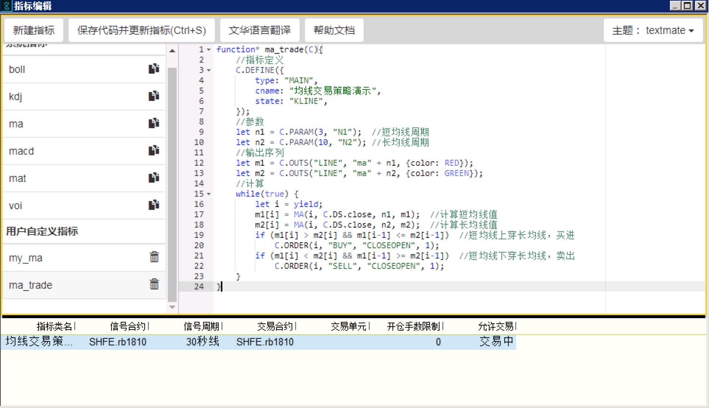

.. _program_indicator:

程序化指标
================================================

我们以一个简单的例子来说明创建程序化指标的过程。

目标：
    创建一个包括 3、10 两个不同周期的移动均线指标，当 3 均线向上穿过 10 均线，买入；当 3 均线向下穿过 10 均线，卖出。

step1: 在指标管理器中创建指标
~~~~~~~~~~~~~~~~~~~~~~~~~~~~~~~~~~~~~~~~~~~~~~~~~~

点击主菜单上的 [指标编辑]，打开指标管理器，新建一个指标。

step2: 修改指标名称、指标定义、输出序列
~~~~~~~~~~~~~~~~~~~~~~~~~~~~~~~~~~~~~~~~~~~~~~~~~~

修改指标名称、指标定义、输出序列，这些和编写一个普通的技术指标（ :ref:`write` ）是相同的，示例如下：

.. code-block:: javascript

    function* ma_trade (C) {
        //指标定义
        C.DEFINE({
            type: "MAIN",
            cname: "均线交易策略",
            state: "KLINE",
        });
        //输出序列
        let m1 = C.OUTS("LINE", "ma" + n1, {color: RED});
        let m2 = C.OUTS("LINE", "ma" + n2, {color: GREEN});
        // 计算
        while(true) {
            let i = yield;
            m1[i] = MA(i, C.DS.close, 3, m1);  // 计算 3 均线值
            m2[i] = MA(i, C.DS.close, 10, m2);  // 计算 10 均线值
            // 添加下单策略
        }
    }

step3: 添加交易逻辑
~~~~~~~~~~~~~~~~~~~~~~~~~~~~~~~~~~~~~~~~~~~~~~~~~~

下面添加交易逻辑，

.. code-block:: javascript

    while(true) {
        let i = yield;
        m1[i] = MA(i, C.DS.close, 3, m1);  // 计算 3 均线值
        m2[i] = MA(i, C.DS.close, 10, m2);  // 计算 10 均线值
        if (m1[i] > m2[i] && m1[i-1] <= m2[i-1]) {
            // 3 均线上穿 10 均线，买进
            C.ORDER(i, "BUY", "CLOSEOPEN", 1);
        }
        if (m1[i] < m2[i] && m1[i-1] >= m2[i-1]) {
            // 3 均线下穿 10 均线，卖出
            C.ORDER(i, "SELL", "CLOSEOPEN", 1);
        }
    }

:ref:`C.ORDER` 是一个系统函数，用于发送委托单到服务器，"CLOSEOPEN" 表示自动开平。

step4: 保存并运行
~~~~~~~~~~~~~~~~~~~~~~~~~~~~~~~~~~~~~~~~~~~~~~~~~~

现在完整的代码应该是如下所示：

.. code-block:: javascript

    function* ma_trade (C) {
        //指标定义
        C.DEFINE({
            type: "MAIN",
            cname: "均线交易策略",
            state: "KLINE",
        });
        //输出序列
        let m1 = C.OUTS("LINE", "ma" + n1, {color: RED});
        let m2 = C.OUTS("LINE", "ma" + n2, {color: GREEN});
        //计算
        while(true) {
            let i = yield;
            m1[i] = MA(i, C.DS.close, 3, m1);  // 计算 3 均线值
            m2[i] = MA(i, C.DS.close, 10, m2);  // 计算 10 均线值
            if (m1[i] > m2[i] && m1[i-1] <= m2[i-1]) {
                // 3 均线上穿 10 均线，买进
                C.ORDER(i, "BUY", "CLOSEOPEN", 1);
            }
            if (m1[i] < m2[i] && m1[i-1] >= m2[i-1]) {
                // 3 均线下穿 10 均线，卖出
                C.ORDER(i, "SELL", "CLOSEOPEN", 1);
            }
        }
    }

点击 "保存代码并更新指标"，应该有以下几项变化：

* 左侧的指标列表中，当前编辑的指标名称自动更新为 "ma_trade"。
* 在主程序中图表上的右键菜单 [新增技术指标] 中，应该可以找到刚添加上去的 "ma_trade" 指标。
* 在安装目录的 ``extention/libs/custom`` 目录下，应该有 ma_trade.js 文件，文件内容就是刚刚保存的代码。

step5: 软件中添加
~~~~~~~~~~~~~~~~~~~~~~~~~~~~~~~~~~~~~~~~~~~~~~~~~~

在主程序中图表上的右键菜单 [新增技术指标] 中，选择新增加的 "ma_trade" 指标，此时 K 线图上应该添加了买卖点位示意图。

step6: 开启交易功能
~~~~~~~~~~~~~~~~~~~~~~~~~~~~~~~~~~~~~~~~~~~~~~~~~~

在 [指标编辑] 板块下方，选择右键菜单中 [添加新的程序化指标]，此时，在符合交易逻辑的时候，系统就会发送委托单了。

选中某个交易指标，右键菜单中可以选择 [开启交易] 或者 [暂停交易功能]。
