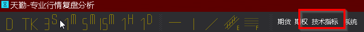
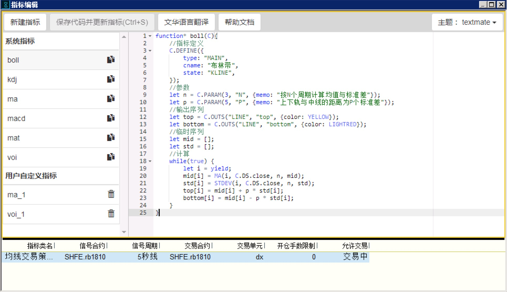
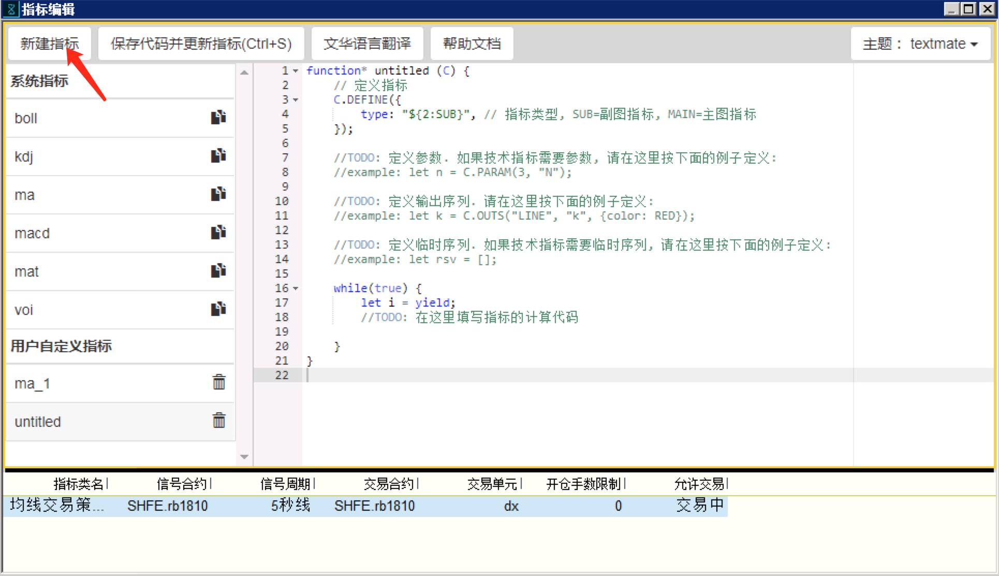
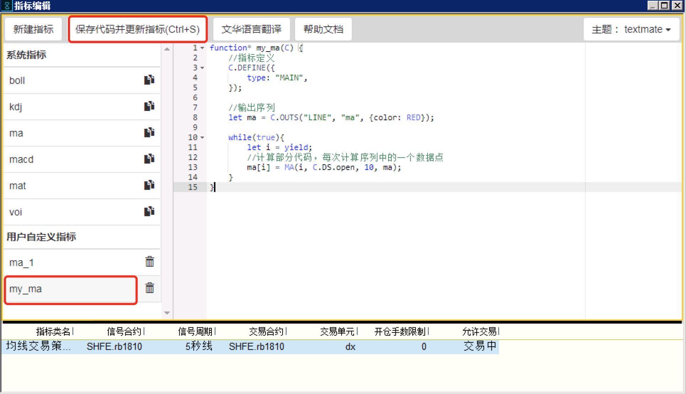

.. _write:

用 javascript 编写技术指标
=======================================
我们以一个简单的例子来说明创建自定义技术指标的过程

目标：创建一个自定义的移动均线指标，它以K线的开盘价，而非收盘价来计算移动平均线。

step1: 在指标管理器中创建指标
~~~~~~~~~~~~~~~~~~~~~~~~~~~~~~~~~~~~~~~~~~~~~~~~~~
* 点击主菜单上的"技术指标", 打开指标管理器

打开后的指标编辑器应该是这样:

* 点击"创建指标", 系统会为您创建一个名为 "untitled" 的空指标，包含了指标的模版代码

step2: 修改指标名称
~~~~~~~~~~~~~~~~~~~~~~~~~~~~~~~~~~~~~~~~~~~~~~~~~~

这里设置指标名称为 "my_ma"，也就是将函数名称修改为 "my_ma"。

.. code-block:: javascript

    function* my_ma (C) {
        // ......
    }

step3: 修改指标定义
~~~~~~~~~~~~~~~~~~~~~~~~~~~~~~~~~~~~~~~~~~~~~~~~~~

将指标定义中的 type 由 "SUB" 改为 "MAIN", 表示这个指标是一个主图指标:

.. code-block:: javascript

    function* my_ma (C) {
        // 定义指标
        C.DEFINE({
            type: "MAIN", // 指标类型, SUB=副图指标, MAIN=主图指标
        });

        // ......
    }

step4: 定义输出序列
~~~~~~~~~~~~~~~~~~~~~~~~~~~~~~~~~~~~~~~~~~~~~~~~~~
在编辑器中继续加入以下代码：

.. code-block:: javascript

    //输出序列
    let ma = C.OUTS("LINE", "ma", {color: RED});

:ref:`C.OUTS` 是一个系统函数，用于创建一个输出数据序列，在这里，我们创建了一个名称为"ma"的输出序列，显示形式为折线图，颜色为红色。创建好的输出序列被赋值到变量 ma 中。

step5: 加入计算部分
~~~~~~~~~~~~~~~~~~~~~~~~~~~~~~~~~~~~~~~~~~~~~~~~~~
在编辑器中继续加入以下代码：

.. code-block:: javascript

    while(true){
        let i = yield;
        //计算部分代码，每次计算序列中的一个数据点
        ma[i] = MA(i, C.DS.open, 10, ma);
    }

其中实现计算的是这一句

.. code-block:: javascript

    ma[i] = MA(i, C.DS.open, 10, ma);

在这一句中，我们调用了计算函数 :ref:`MA`, 这里的含义翻译过来是：

    ma序列的第i个值 = 求平均数(位置是i, 要算平均数的序列是open，计算平均数的范围是10，计算结果放到ma序列)

C.DS 是一个指向当前 K 线序列的对象，它其实与接口 :ref:`GET_KLINE <api_get_kline>` 返回的是相同的数据结构，C.DS.open 表示当前 K 线开盘价的序列。

整段代码完全翻译过来的意思是:

.. code-block:: javascript

    while(true){                                    //循环开始，一直循环
        let i = yield;                              //由系统决定要计算哪一个数据点，这个点的序号取出来，存到i里面
        ma[i] = MA(i, C.DS.open, 10, ma);                //ma序列的第i个值 = 求平均数(位置是i, 要算平均数的序列是open，计算平均数的范围是10，计算结果放到ma序列)
    }                                               //这一个点算完了，回到循环开始的地方继续

step5: 试运行
~~~~~~~~~~~~~~~~~~~~~~~~~~~~~~~~~~~~~~~~~~~~~~~~~~
到这里为止，我们的指标代码看起来应该像这样:

.. code-block:: javascript

    function* my_ma(C) {
        //指标定义
        C.DEFINE({
            type: "MAIN",
        });

        //输出序列
        let ma = C.OUTS("LINE", "ma", {color: RED});

        while(true){
            let i = yield;
            //计算部分代码，每次计算序列中的一个数据点
            ma[i] = MA(i, C.DS.open, 10, ma);
        }
    }

点击 "保存代码并更新指标"，应该有以下几项变化：

* 左侧的指标列表中，当前编辑的指标名称自动更新为 "my_ma"。
* 在主程序中图表上的右键菜单 [新增技术指标] 中，应该可以找到刚添加上去的 "my_ma" 指标。
* 在安装目录的 ``extention/libs/custom`` 目录下，应该有 my_ma.js 文件，文件内容就是刚刚保存的代码。

step6: 加入指标参数
~~~~~~~~~~~~~~~~~~~~~~~~~~~~~~~~~~~~~~~~~~~~~~~~~~
上一步中写出来的指标, 均值周期被固定为10. 如果希望将它做成一个可调整的参数, 可以把代码改成这样

.. code-block:: javascript

    function* myma(C) {
        //指标定义
        C.DEFINE({
            type: "MAIN",
        });

        //参数
        let n = C.PARAM(10, "N");

        //输出序列
        let ma = C.OUTS("LINE", "ma", {color: RED});

        while(true){
            let i = yield;
            //计算部分代码，每次计算序列中的一个数据点
            ma[i] = MA(i, C.DS.open, n, ma);
        }
    }

与前面相比，主要是增加了这一行:

.. code-block:: javascript

    let n = C.PARAM(10, "N");

在这一句中，我们调用了系统函数 :ref:`C.PARAM`, 这里的含义翻译过来是：

    n = 参数(默认值为10, 名称为"N");

在下面计算时, 我们就可以直接使用这个参数变量了:

.. code-block:: javascript

    ma[i] = MA(i, C.DS.open, n, ma);

在主程序中再新增技术指标，就能够填入不同的参数了。

概念
~~~~~~~~~~~~~~~~~~~~~~~~~~~~~~~~~~~~~~~~~~~~~~~~~~
下面是本文一些常见概念与 javascript 间的对应关系：

指标:

    一个指标是一个 javascript generator, 它内部包含一个死循环, 循环每次执行时, 从外部获取需要计算的位置, 并计算出各输出序列上该点的值。

进一步使用
~~~~~~~~~~~~~~~~~~~~~~~~~~~~~~~~~~~~~~~~~~~~~~~~~~

目前为止，已经可以为 K 线添加各种各样的技术指标了，但是最终我们希望能够在计算指标同时完成发送交易指令，并在 K 线历史数据上标注出期望的买卖位置。

那么，天勤软件交易指标中怎样设计一个带有交易功能的指标呢？

下一篇文档： :ref:`program_indicator`

其他学习文档
~~~~~~~~~~~~~~~~~~~~~~~~~~~~~~~~~~~~~~~~~~~~~~~~~~

到这里为止，您已经完成了一个技术指标的创建流程。下面是更进一步的信息:

* 如果您对 javascript 的语法还不熟悉，这里(https://developer.mozilla.org/zh-CN/docs/Web/JavaScript/A_re-introduction_to_JavaScript) 有一份很好的教材. 如果您只是对generator 或 yield之类的东西还感到迷惑，可以看看这里 http://es6.ruanyifeng.com/#docs/generator
* 如果您已经有在其它行情软件中编写技术指标的经验和积累，希望快速的将其它软件中的指标代码迁移过来，请看 :ref:`convert`
* 如果您希望以其它计算机语言来实现自定义技术指标，请看 :ref:`extern`
* 如果您想看看更多的指标代码示例，系统内置的所有指标代码都可供您参考. 另外，对于一些常见的问题需求，请看 :ref:`examples`
* 希望深入了解天勤提供的函数，请看 :ref:`cfunc` 和 :ref:`efunc`.

