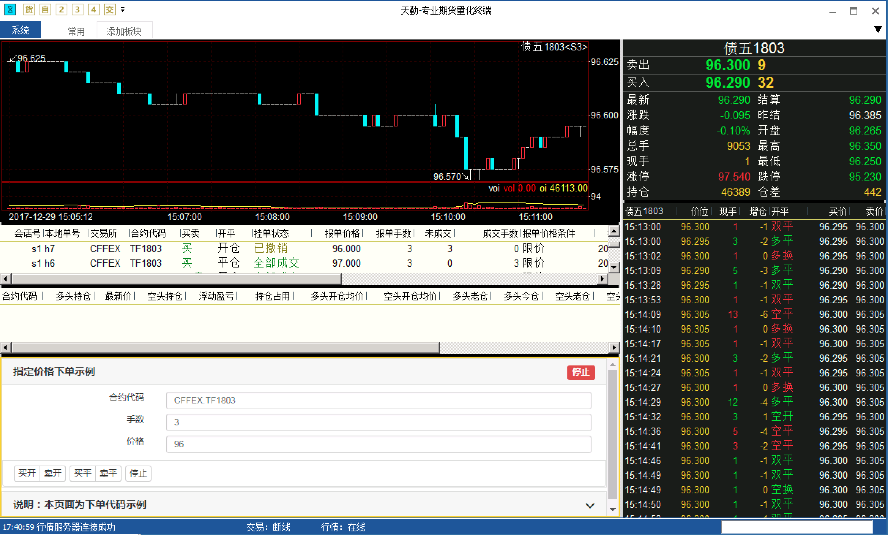
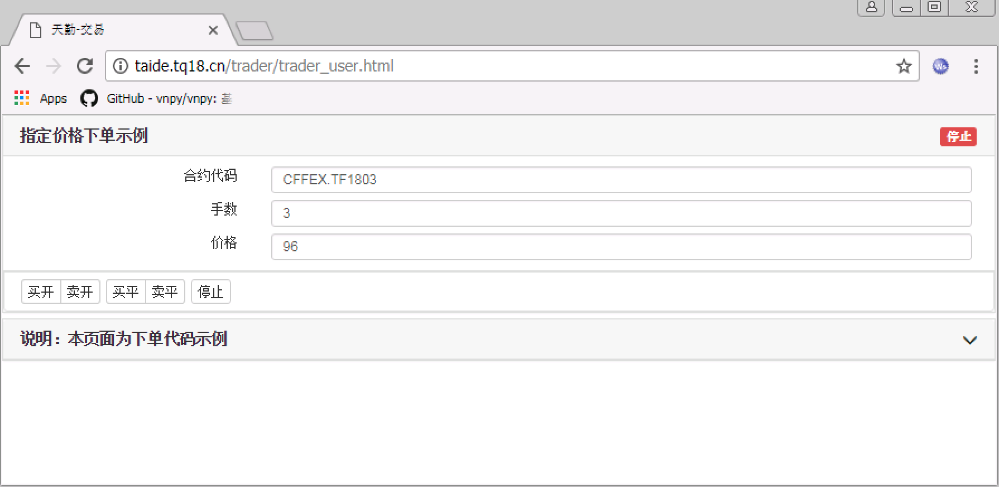

.. _2_1_new:

新建页面
==================

软件自带的交易页面存储的位置在 <...>，本章的通过一步步完成其中 ``trader_example.html``，来告诉用户如何自定义交易程序。

新建文件
-------------------------------------------------------
在交易页面存储的目录下，新建一个文件，文件名 ``trader_user.html``。

填入以下代码

.. code-block:: html

    <!DOCTYPE html>
    <html lang="en">
    <head>
        <meta charset="utf-8">
        <meta http-equiv="X-UA-Compatible" content="IE=edge">
        <meta name="viewport" content="width=device-width, initial-scale=1, maximum-scale=1, user-scalable=no">
        <title>天勤-交易</title>
        <link href="/assets/bootstrap/css/bootstrap.min.css" rel="stylesheet">
        <link rel="stylesheet" href="/assets/highlight/styles/atom-one-light.css">
        <link rel="stylesheet" href="index.css">
    </head>
    <body>
        

            <!-- html 代码 -->
        

        
        
        
    </body>
    </html>

你一定注意到了，这段代码中有两个空缺的位置：

``<!-- html 代码 -->`` : 这里需要填入界面相关的 html。

``/* javascript 代码 */`` : 这里就是我们要写 javascript 代码的位置。

在浏览器中打开页面，现在应该是空白的页面。

补充界面
-------------------------------------------------------

``<!-- html 代码 -->`` 的位置可以直接复制 trader_example.html 中的内容。

此时有两种方式可以开到我们修改后的界面：

方式一、在天勤客户端中打开
*******************************************************
选择 “添加板块” --> “扩展板块”，右击新添加的板块，右键菜单中选择配置，在配置界面中 URL 字段中，填入 http://taide.tq18.cn/trader/trader_user.html。

这时候软件中应该能够显示以下界面：

方式二、在 Chrome 浏览器中打开
*******************************************************
打开 Chrome 浏览器，输入地址 http://taide.tq18.cn/trader/trader_user.html。

这时候页面应该能够显示以下界面：

下一步
-------------------------------------------------------
目前只显示了简单的页面，点击按钮并没有任何反应，下一步我们先初始化页面。