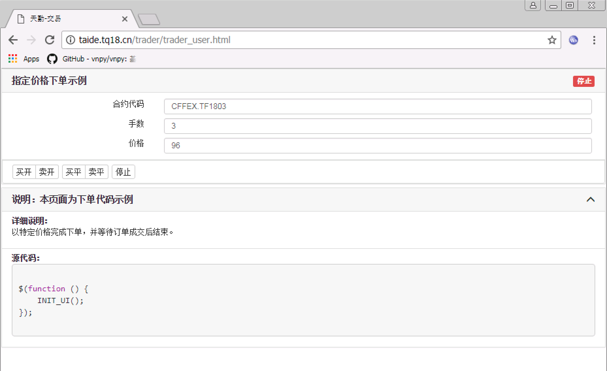

.. _2_2_config:

设置界面
=======================================

本项目使用了 JQuery，所有的 JQuery 方法 都可以使用。

初始化界面，调用全局方法 ``INIT_UI()``，点击说明栏处，可以展开看到下单策略详细说明和源代码。

INIT_UI() 必须在 $() 中调用。

.. code-block:: javascript

    $(function () {
        INIT_UI();
    });

这时候软件中应该能够显示以下界面：

